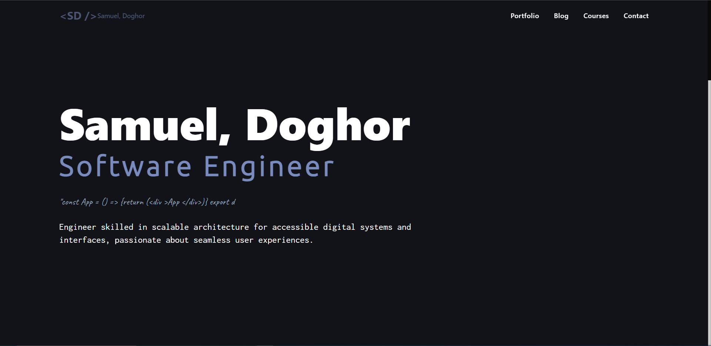

# Hi there 👋🏿

This is my personal portfolio/website

## Live

[Samuel, Doghor](https://samdoghor.com) - website

[Blog Admin Page](https://app.samdoghor.com) - website

[Blog Admin Repo](https://github.com/samdoghor/simple-blog) - repo

Built with [Vite-React](https://vitejs.dev/), [TailwindCSS](https://tailwindcss.com/) and hosted frontend, backend & Database with [Vercel](https://vercel.com/).

<!-- Built with [Vite-React](https://vitejs.dev/), [Three JS](https://threejs.org/), [TailwindCSS](https://tailwindcss.com/) and hosted frontend with [Vercel](https://vercel.com/) while backend & Database with [Render](https://render.com/). -->

<!--  -->

## Connect with me

## Attribution

Inspired by [Segun Adebayo](https://github.com/segunadebayo/adebayosegun.com)
