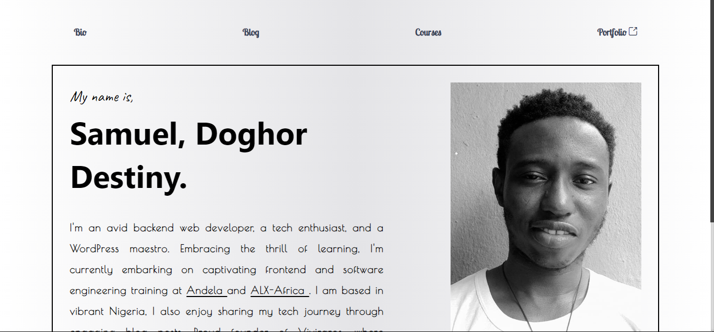

# Personal Web Page

Built Vue 3 + Vite Template, Tailwind and deployed to Vercel.

This template should help you get started developing with Vue 3 using Vite. The template makes use of Vue 3's `<script setup>` SFCs, which provide a more concise and streamlined syntax for script blocks. To learn more about `<script setup>`, check out the [script setup documentation](https://v3.vuejs.org/api/sfc-script-setup.html#sfc-script-setup).

## Recommended IDE Setup

We recommend the following IDE setup for the best development experience:

- [VS Code](https://code.visualstudio.com/)
- [Volar](https://marketplace.visualstudio.com/items?itemName=Vue.volar) (Disable Vetur if installed)
- [TypeScript Vue Plugin (Volar)](https://marketplace.visualstudio.com/items?itemName=Vue.vscode-typescript-vue-plugin)

## Project Description

### Live

[Website](https://app.samdoghor.com)



### Contact Me

You can find me on social media and other platforms:

- Twitter: [@samdoghor](https://www.twitter.com/samdoghor)
- GitHub: [github.com/samdoghor](https://www.github.com/samdoghor)
- Instagram: [instagram.com/samdoghor](https://www.instagram.com/samdoghor)
- LinkedIn: [linkedin.com/in/samdoghor](https://www.linkedin.com/in/samdoghor)
- WhatsApp: [wa.me/qr/CGHZ23GBYBKLC1](https://wa.me/qr/CGHZ23GBYBKLC1)
- Email: [talkto@samdoghor.com](mailto:talkto@samdoghor.com)

## Getting Started

Follow these steps to get started with the project:

- Clone this repository to your local machine:

```bash
git clone https://github.com/samdoghor/samdoghor-front-page
```

- Install the dependencies using your package manager:

```bash
npm install
# or
yarn install
```

- Run the development server:

```bash
npm run dev
# or
yarn dev
```
