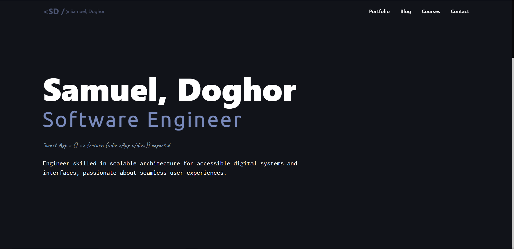

# Hi there 👋🏿

This is my personal portfolio/website

## Live

[Samuel, Doghor](https://samdoghor.com) - website

[Blog Admin Page](https://app.samdoghor.com) - website

[Blog Admin Repo](https://github.com/samdoghor/simple-blog) - repo

Built with [Vite-React](https://vitejs.dev/), [TailwindCSS](https://tailwindcss.com/) and hosted frontend, backend & Database with [Vercel](https://vercel.com/).

## Marketplace setup

Marketplace files are kept in a private S3 bucket and are never placed in `public/`, Git, or the browser bundle. The included Vercel functions verify Paystack payments and return a presigned S3 URL that expires after 15 minutes.

Set the variables in `.env.example` in the Vercel project settings. Use a dedicated AWS IAM user or role with only `s3:HeadObject` and `s3:GetObject` access to the marketplace bucket. Keep `PAYSTACK_SECRET_KEY`, AWS credentials, and S3 object keys server-side; do not prefix them with `VITE_`.

Upload each product as one protected bundle, for example:

```text
marketplace/wellhead-model/v1/wellhead-model.zip
```

The bundle can contain multiple formats such as `.sldprt`, `.step`, `.nwd`, `.dwg`, `.dxf`, and documentation. Add the product to `src/marketplaceProducts.js`, then configure its matching `PRODUCT_<ID>_S3_KEY` environment variable.

<!-- Built with [Vite-React](https://vitejs.dev/), [Three JS](https://threejs.org/), [TailwindCSS](https://tailwindcss.com/) and hosted frontend with [Vercel](https://vercel.com/) while backend & Database with [Render](https://render.com/). -->

<!--  -->



## Connect with me

[](https://instagram.com/samdoghor)
[](https://twitter.com/samdoghor)
[](https://linkedin.com/in/samdoghor)

## Attribution

Inspired by [Segun Adebayo](https://github.com/segunadebayo/adebayosegun.com)
